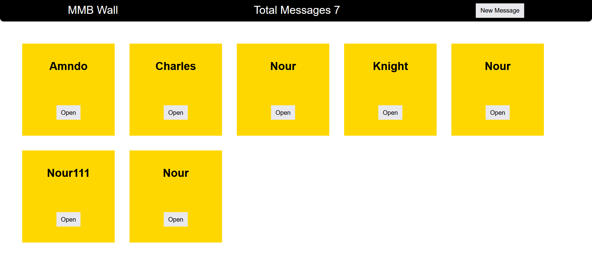

# Mini Message Board

The Mini Message Board is a simple web application that allows users to post and view messages. It is built using Node.js, Express.js, and PostgreSQL, and it uses EJS as the templating engine for rendering views.



## Features

- View a list of messages.
- Post new messages with a username and message content.
- View detailed information about individual messages.

## Project Structure

```
mini-message-board/
├── app.js                # Main application entry point
├── package.json          # Project metadata and dependencies
├── README.md             # Project documentation
├── controllers/          # Controller functions for handling requests
│   ├── getDetailedMessage.js
│   ├── getMessages.js
│   ├── newMessage.js
│   └── postMessage.js
├── db/                   # Database configuration and queries
│   ├── pool.js
│   ├── populatedb.js
│   └── queries.js
├── public/               # Static assets (CSS, images, etc.)
│   └── style.css
├── routes/               # Application routes
│   ├── indexRouter.js
│   ├── messageRouter.js
│   └── newMessageRouter.js
└── views/                # EJS templates for rendering HTML
    ├── form.ejs
    ├── index.ejs
    └── message.ejs
```

## Installation

1. Clone the repository:
   ```bash
   git clone <repository-url>
   cd mini-message-board
   ```

2. Install dependencies:
   ```bash
   npm install
   ```

3. Set up the environment variables:
   Create a `.env` file in the root directory and add the following variables:
   ```env
   PORT_APP=3000
   USER=<your-database-username>
   PASSWORD=<your-database-password>
   PORT_DB=5432
   ```

4. Set up the database:
   Run the database population script to create the necessary tables and seed initial data:
   ```bash
   node db/populatedb.js
   ```

## Usage

1. Start the server:
   ```bash
   npm start
   ```

2. Open your browser and navigate to:
   ```
   http://localhost:3000
   ```

3. Features:
   - View all messages on the homepage.
   - Post a new message by navigating to `/new`.
   - View a detailed message by navigating to `/message/:messageId`.

## API Endpoints

### GET `/`
- Description: Fetch and display all messages.
- Response: Renders the `index.ejs` view with a list of messages.

### GET `/new`
- Description: Display a form to create a new message.
- Response: Renders the `form.ejs` view.

### POST `/new`
- Description: Submit a new message.
- Request Body:
  ```json
  {
    "username": "string (1-33 characters, only letters)",
    "text": "string (1-255 characters)"
  }
  ```
- Response: Redirects to the homepage on success or re-renders the form with validation errors.

### GET `/message/:messageId`
- Description: Fetch and display details of a specific message.
- Response: Renders the `message.ejs` view with the message details.

## Technologies Used

- **Node.js**: JavaScript runtime for building the server.
- **Express.js**: Web framework for handling routes and middleware.
- **EJS**: Templating engine for rendering dynamic HTML.
- **PostgreSQL**: Database for storing messages.
- **dotenv**: For managing environment variables.
- **express-validator**: For validating and sanitizing user input.

## Database Schema

The application uses a PostgreSQL database with the following schema:

```sql
CREATE TABLE IF NOT EXISTS messages (
    id INTEGER PRIMARY KEY GENERATED ALWAYS AS IDENTITY,
    username VARCHAR (33),
    text VARCHAR (255),
    added DATE DEFAULT CURRENT_DATE
);
```

## How It Works

1. **Homepage (`/`)**: Displays all messages stored in the database using the `getMessages` controller and `Messages` query.
2. **New Message Form (`/new`)**: Renders a form for users to submit a new message using the `newMessage` controller.
3. **Submit Message (`POST /new`)**: Validates and processes the form data using `postMessage` and `insertMessage` query, then redirects to the homepage.
4. **Message Details (`/message/:messageId`)**: Displays detailed information about a specific message using the `getDetailedMessage` controller and `DetailedMessage` query.

## License

This project is licensed under the ISC License.

---

Feel free to contribute or report issues to improve this project!
